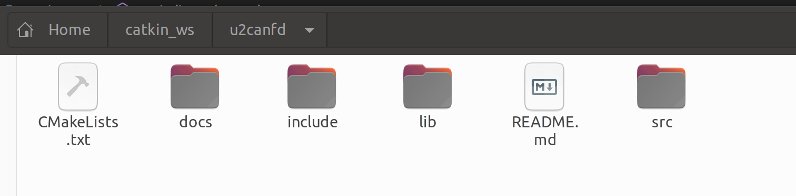
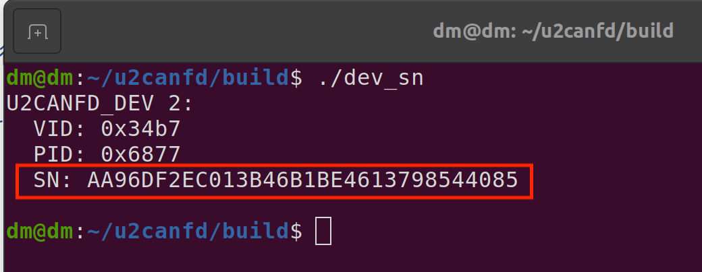
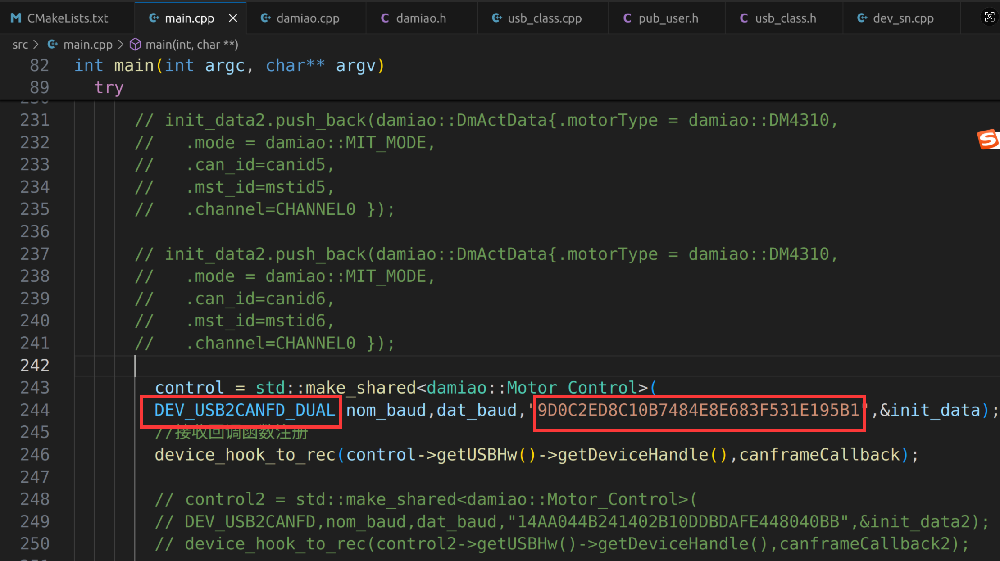

# 使用USB转CANFD驱动达妙电机，c++例程

## 介绍
这是控制达妙电机的c++例程。

硬件设备需要达妙的**USB转单路或者双路CANFD设备**。

程序测试环境是gcc13。

程序默认运行的效果是使用**USB转双路CANFD设备*先让canid为0x01、mstid为0x11的DM4310电机控制模式设置为MIT模式，然后使能，然后旋转，**电机波特率为5M**。

***注意：5M波特率下，电机有多个时，需要在末端电机接一个120欧的电阻***

## 软件架构
使用c++语言，没有用到ros

## 安装和编译

首先需要确保系统安装了libusb库，版本为**1.0.29**，版本不能低于这个。

然后打开终端，输入：
```shell
mkdir -p ~/catkin_ws
cd ~/catkin_ws
```
然后把gitee上的**u2canfd**文件夹放到catkin_ws目录下。

如下所示：



接着打开终端，输入：
```shell
cd ~/catkin_ws/u2canfd
mkdir build
cd build
cmake ..
make
```
## 简单使用
首先用最新上位机给电机设置5M波特率。

然后给**USB转CANFD设备**设置权限，在终端输入：
```shell
sudo nano /etc/udev/rules.d/99-usb.rules
```
然后写入内容：
```shell
SUBSYSTEM=="usb", ATTR{idVendor}=="34b7", ATTR{idProduct}=="6877", MODE="0666"
SUBSYSTEM=="usb", ATTR{idVendor}=="34b7", ATTR{idProduct}=="6632", MODE="0666"
```
第一行是USB转**单路**CANFD设备，第二行是第一行是USB转**双路**CANFD设备。

然后重新加载并触发：
```shell
sudo udevadm control --reload-rules
sudo udevadm trigger
```
***注意：这个设置权限只需要设置1次就行，重新打开电脑、插拔设备都不需要重新设置**

然后需要通过程序找到**USB转CANFD设备**的Serial_Number，在你刚刚编译的build文件夹中打开终端运行dev\_sn文件:
```shell
cd ~/catkin_ws/u2canfd/build
./dev_sn
```


上面图片里的SN后面的一串数字就是该设备的的Serial_Number，

接着复制该Serial\_Number，打开main.cpp，替换程序里的Serial\_Number，同时选择是**USB转单路CANFD**还是**双路CANFD**，如下图所示：



然后重新编译，打开终端输入：
```shell
cd ~/catkin_ws/u2canfd/build
make
```

在你刚刚编译的build文件夹中打开终端运行dm_main文件:
```shell
cd ~/catkin_ws/u2canfd/build
./dm_main
```
此时你会发现电机亮绿灯，并且旋转

